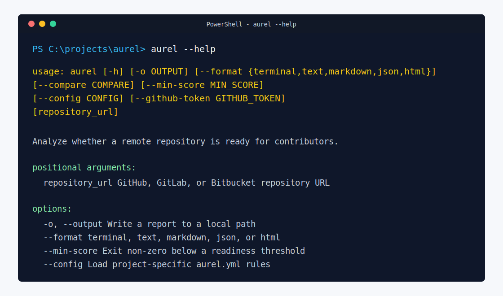

# Contributing To Aurel

This guide is for contributors who want to run Aurel locally, make a focused change, and open a pull request that maintainers can review quickly.

## Quick Path

1. Create and activate a virtual environment.
2. Install Aurel in editable mode.
3. Run `aurel start` to confirm the CLI works.
4. Make one focused change.
5. Run `python -m pytest`.
6. Update docs or examples when user-facing behavior changes.

## Branch And Pull Request Flow

Create a short-lived branch for each focused change:

```bash
git switch -c docs/clarify-setup
```

Commit with one of the project prefixes from [Commit Style](#commit-style), then push the branch and open a pull request against `main`. Keep the pull request description short: explain what changed, why it helps contributors, and how you checked it.

After the pull request is merged, delete the branch unless you need it for follow-up work.

## Local Setup

Clone the repository, create a virtual environment, then activate it before installing dependencies.

On Windows PowerShell:

```powershell
py -3 -m venv .venv
.\.venv\Scripts\Activate.ps1
python -m pip install --upgrade pip
python -m pip install -e .
python -m pip install -r requirements.txt
aurel start
```

On macOS or Linux:

```bash
python3 -m venv .venv
source .venv/bin/activate
python -m pip install --upgrade pip
python -m pip install -e .
python -m pip install -r requirements.txt
aurel start
```

Run `aurel start` after activating the environment to confirm the AUREL banner appears before using analysis commands.


If PowerShell blocks activation scripts, run `Set-ExecutionPolicy -Scope CurrentUser RemoteSigned` or use `.\.venv\Scripts\python.exe -m pip install -e .`.

If virtual environment creation fails during `ensurepip` with a temp-directory `PermissionError`, fix `%TEMP%` permissions or use a standard Python install from python.org before retrying.

If Windows says `aurel` is not recognized after installing outside `.venv`, pip likely wrote `aurel.exe` to the Python user `Scripts` directory without adding it to `PATH`. Prefer the project virtual environment, or add that Scripts directory to the current PowerShell session before testing:

```powershell
$scriptDir = python -c "import sysconfig; print(sysconfig.get_path('scripts', 'nt_user'))"
$env:Path = "$env:Path;$scriptDir"
aurel start
```

## Run The CLI

Activate the environment first in each new terminal:

```powershell
.\.venv\Scripts\Activate.ps1
aurel start
```

```bash
aurel https://github.com/owner/repo
```

Use `aurel --help` when you need to check available flags:



Generate a Markdown report:

```bash
aurel https://github.com/owner/repo --output reports/readiness.md
```

Generate a plain text report document:

```bash
aurel https://github.com/owner/repo --format text --output reports/readiness.txt
```

If the CLI reports `Could not reach remote provider`, the package launched correctly but the network could not reach the provider API. Check VPN, proxy, firewall, or GitHub rate limits before changing code.

For report examples, see [examples/sample_report.md](examples/sample_report.md). For automation usage, see [docs/CI_USAGE.md](docs/CI_USAGE.md).

## Run Tests

```bash
python -m pytest
```

Tests should not require live remote API calls. Use fakes or mocks for network behavior.

## Automated Checks

GitHub Actions run on branch pushes and pull requests. Before opening a pull request, run the checks that match CI where possible:

```bash
python -m pytest
ruff check .
mypy aurel --no-sqlite-cache
bandit -q -r aurel
pip-audit -r requirements.txt --strict
```

The repository also runs CodeQL and dependency review in GitHub. If a security or dependency check fails, fix the reported issue before requesting review.

## What To Work On

Aurel is meant to be easy to improve without paid services. Good contribution areas include:

- add repository profile signals in `aurel/profiles.py`
- add flexible community-file paths in `aurel/checks.py`
- improve README/setup findings in `aurel/analyzer.py`
- add deterministic recommendation rules in `aurel/advisor.py`
- improve score explanations in `aurel/scorer.py`
- add text, Markdown, JSON, or HTML report sections in `aurel/report.py`
- add tests for every behavior change

Core analysis must stay free to run. Do not add mandatory hosted AI, paid APIs, or secrets. Optional integrations should be disabled by default and clearly documented.

## Community Standards

Please follow [CODE_OF_CONDUCT.md](CODE_OF_CONDUCT.md) in issues, pull requests, reviews, and discussions. Keep feedback specific, respectful, and focused on making the project easier for beginners and maintainers.

## Commit Style

Use short, clear commit messages:

- `feat:` new feature
- `fix:` bug fix
- `docs:` documentation
- `test:` tests
- `ci:` GitHub Actions
- `chore:` setup or maintenance
- `refactor:` code cleanup

Examples:

```text
feat: add markdown readiness reports
test: cover invalid repository URLs
docs: clarify local setup
```

## Pull Requests

Keep pull requests focused. Include:

- what changed
- why it changed
- how you tested it

If your change affects user-facing output, update the README or sample report.
