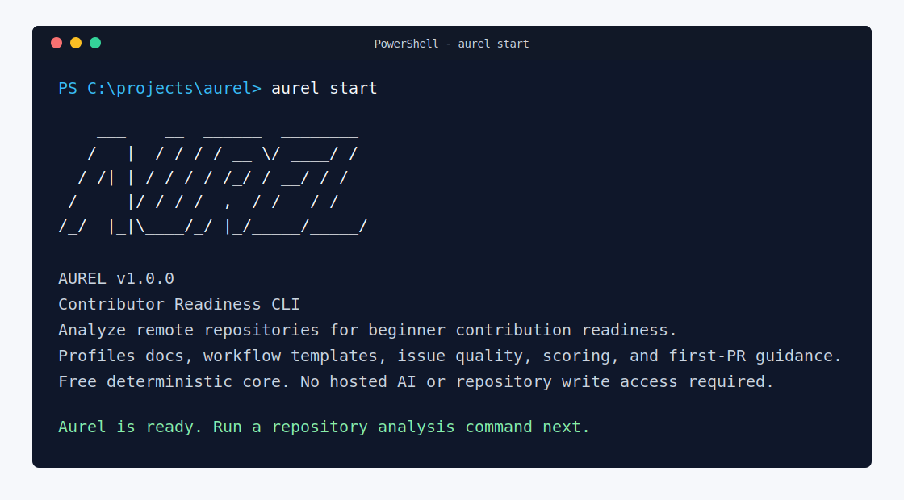

# Aurel

Contributor Readiness CLI for beginner contributors, maintainers, and open-source programs.

Aurel analyzes remote repositories and explains how approachable they are for contribution. It does not treat every project as the same kind of repository. Instead, it detects the repository profile, looks for flexible contributor-readiness signals, checks whether existing documentation is useful, and generates practical reports.

Aurel is designed to stay free to run. It does not require OpenAI, a paid API, a hosted model, or repository write access.

## Why Aurel Exists

Many beginners want to contribute to open source but are unsure where to begin. Maintainers and program organizers also need a realistic way to understand whether a repository is ready for outside contributors.

Aurel focuses on a practical question:

Can a contributor understand this repository well enough to make a useful first contribution?

## Features

- Accepts GitHub, GitLab, and Bitbucket repository URLs.
- Detects broad repository profiles, including Python, JavaScript/TypeScript, Java, Go, Rust, C/C++, documentation projects, community repos, templates, and general repositories.
- Supports flexible file locations instead of one hardcoded filename:
  - README alternatives such as `README.md`, `README.rst`, `.github/README.md`, `docs/index.md`, and `docs/README.md`
  - license alternatives such as `LICENSE`, `LICENSE.md`, and `COPYING`
  - contribution/security/code-of-conduct files in root, `.github/`, or `docs/`
- Checks existing README content for common contributor friction:
  - very short docs
  - placeholder text
  - missing setup path
  - missing usage example
  - missing testing instructions
  - missing exact install, run, test, lint, or build commands
- Generates evidence-backed findings with severity, confidence, category, and score-cap impact.
- Generates prioritized top fixes to reach 90+ with effort, confidence, evidence, and estimated score gain.
- Generates a newcomer onboarding path: what to read first, run first, and change first.
- Adds acceptance criteria to improvement backlog items.
- Calculates a rigorous contributor-readiness score across five categories.
- Applies score caps so incomplete repositories cannot receive inflated 90+ scores.
- Detects issue templates and pull request templates in common GitHub and GitLab locations.
- Checks beginner issue readiness across GitHub, GitLab, and Bitbucket where provider data is available.
- Adds issue-quality hints when beginner issues look too thin for first-time contributors.
- Adds maintainer guidance and program organizer notes for cohort or classroom use.
- Provides a Starter PR Kit and improvement backlog.
- Generates plain text, Markdown, JSON, and lightweight HTML reports with `--format`.
- Writes report documents with `--output`, including `.txt` files for sharing or download.
- Compares two JSON reports with `--compare`.
- Supports CI score gates with `--min-score`.
- Supports optional GitHub token usage through `--github-token` or `GITHUB_TOKEN` for higher public API rate limits.
- Scopes GitHub tokens to GitHub requests only.
- Supports project-specific rules, presets, custom beginner labels, and command checks through `aurel.yml`.

## Installation

For local development on Windows PowerShell:

```powershell
py -3 -m venv .venv
.\.venv\Scripts\Activate.ps1
python -m pip install --upgrade pip
python -m pip install -e .
python -m pip install -r requirements.txt
aurel start
```

The `start` command prints the AUREL ASCII banner and confirms the CLI entry point is ready.

If PowerShell blocks activation scripts, either allow local scripts for your user or run commands through the virtual environment's Python directly:

```powershell
Set-ExecutionPolicy -Scope CurrentUser RemoteSigned
.\.venv\Scripts\python.exe -m pip install -e .
```

For local development on macOS or Linux:

```bash
python3 -m venv .venv
source .venv/bin/activate
python -m pip install --upgrade pip
python -m pip install -e .
python -m pip install -r requirements.txt
aurel start
```

## Usage

Activate the environment first in every new terminal session:

```powershell
.\.venv\Scripts\Activate.ps1
aurel start
```

Preferred syntax:

```bash
aurel [repo link] --output [filename.txt]
```

Then run an analysis:

```bash
aurel https://github.com/owner/repo
```

Terminal runs show an AUREL startup banner before the report. Machine-readable formats such as `--format json` do not include the banner, so CI and dashboards can parse output safely.

Write a plain text report document:

```bash
aurel https://github.com/owner/repo --format text --output reports/readiness.txt
```

When `--format` is omitted, a `.txt` output path automatically writes a text report:

```bash
aurel https://github.com/owner/repo --output reports/readiness.txt
```

Write a Markdown report:

```bash
aurel https://github.com/owner/repo --output reports/readiness.md
```

Write JSON or HTML reports:

```bash
aurel https://github.com/owner/repo --format json --output reports/readiness.json
aurel https://github.com/owner/repo --format html --output reports/readiness.html
```

Compare the current run against a previous JSON report:

```bash
aurel https://github.com/owner/repo --format json --compare reports/previous.json
```

Fail a CI job when readiness is below a threshold:

```bash
aurel https://github.com/owner/repo --format json --min-score 80
```

Use a custom config:

```bash
aurel https://github.com/owner/repo --config examples/aurel.yml
```

Use a GitHub token:

```bash
aurel https://github.com/owner/repo --github-token YOUR_TOKEN
```

The token is optional. Public repositories can be analyzed without one, but GitHub may rate-limit unauthenticated requests more quickly. Aurel only sends this token to GitHub requests.

## Screenshots

Start Aurel and verify the CLI entry point:



Review the readiness score, prioritized fixes, and Starter PR Kit:


## Execution Troubleshooting

If `aurel` prints help, the installed command is working.

```bash
aurel --help
aurel start
```

If `aurel` is not recognized on Windows, the package is not installed in the active environment. Activate `.venv`, then run:

```powershell
python -m pip install -e .
aurel --help
```

If you installed outside a virtual environment and pip says `aurel.exe` was installed in a user `Scripts` directory that is not on `PATH`, either activate a virtual environment and reinstall, or add that Scripts directory to your Windows user `PATH`. For the current PowerShell session, you can test the path like this:

```powershell
$scriptDir = python -c "import sysconfig; print(sysconfig.get_path('scripts', 'nt_user'))"
$env:Path = "$env:Path;$scriptDir"
aurel start
```

If `python -m venv .venv` fails during `ensurepip` with `PermissionError` under `AppData\Local\Temp`, your Windows Python installation cannot write to its temp directory. Fix the `%TEMP%` permissions, run PowerShell as your normal user, or install Python from python.org and retry the setup commands.

If you see `Could not reach remote provider`, the CLI started correctly but could not reach GitHub, GitLab, or Bitbucket over HTTPS. Check VPN/proxy/firewall settings, confirm the provider API is reachable in the browser, or configure `HTTPS_PROXY` if your network requires a proxy.

If GitHub returns `403`, you may be rate-limited. Set `GITHUB_TOKEN` or pass `--github-token`; Aurel only sends that token to GitHub requests.

## Example Output

```text
Repository: github:owner/repo
Detected Profile: Python project (Medium confidence)

Contributor Readiness Score: 58/100 (58%)
Label: Needs improvement
Applied Score Cap: 75 (No contribution workflow guidance was detected.)

Score Categories:
- Documentation Quality: 25/25
- Contributor Workflow: 0/25
- Setup & Testing Clarity: 20/20
- Issue Readiness: 8/15
- Community & Safety: 5/15

Issue Readiness:
- Checked: no; beginner-friendly issues found: 0; thin sampled issues: 0; confidence: Low
- Issue readiness was not checked.

Workflow Templates:
- Issue templates: not detected
- Pull request template: not detected
- Issue and pull request templates were not detected in common locations.

Top Fixes To Reach 90:
- [High, +20] Add contribution guide: Add contributor instructions covering setup, tests, branch naming, review expectations, and first PR guidance.
- [Medium, +15] Add security reporting instructions: Add responsible disclosure instructions or a security contact path.

Newcomer Onboarding Path:
Read First:
- Read README.md for project purpose and setup context.
- Check issues, docs, or maintainer notes for contribution workflow.
- Use the detected profile as context: Python project.
Run First:
- Run the documented install or setup command.
- Run the smallest documented example or local start command.
- Run the documented test command after making a change.
- For Python projects, prefer commands that work from a clean virtual environment.
Change First:
- Add or improve contributor instructions with setup, branch naming, testing steps, and pull request guidelines.
- Start with this report finding: Contribution guide not detected.
- Keep the first pull request small, documented, and easy to review.

Profile Evidence:
+ pyproject.toml
+ requirements.txt

Contributor Signals:
+ Project overview or docs entry point: found at README.md (required)
+ License information: found at LICENSE (required)
? Contribution guide: not detected (required)
? Security reporting instructions: not detected (required)
? Community behavior expectations: not detected (required)

Findings:
- [Medium, Medium confidence] Contribution guide not detected; cap 75: Add contribution instructions covering setup, tests, branch naming, and pull request expectations.
- [Low, Medium confidence] Security reporting instructions not detected; cap 89: Add responsible disclosure instructions or explain where security reports should go.

Starter PR Kit:
Recommended First Contribution: Add or improve contributor instructions with setup, branch naming, testing steps, and pull request guidelines.
Why This Helps: A clear contributing guide helps new developers understand how to make their first change without guessing the workflow.
Confidence: High

Improvement Backlog:
- [High] Add contributor instructions: docs: add contributing guide
  - Acceptance: The guide includes setup, test, branch, and pull request steps.
  - Acceptance: The guide names the smallest safe first contribution path.

Maintainer Guidance:
- Add issue templates so bug reports and feature requests arrive with triage context.
- Add a pull request template with summary, testing, and reviewer checklist fields.

Program Organizer Notes:
- Use this repository cautiously for cohorts until the high-priority readiness gaps are addressed.
- Ask maintainers to add issue templates before routing many first-time contributors here.
```

## Configuration

Aurel looks for `aurel.yml` in the current directory by default. You can also pass a config path with `--config`.

Example:

```yaml
project_type: documentation
audience: students
preset: classroom
scoring:
  readme: 25
  license: 20
  contributing: 20
  security: 15
  code_of_conduct: 10
checks:
  readme_paths:
    - README.md
    - docs/index.md
  contributing_paths:
    - CONTRIBUTING.md
    - docs/contributing.md
  documentation_paths:
    - docs/index.md
  require_readme: false
  require_license: true
  require_contributing: true
  require_security: false
  require_code_of_conduct: false
  beginner_labels:
    - good first issue
    - help wanted
    - first-timers-only
  required_commands:
    - install
    - run
    - test
  command_checks:
    - install
    - run
    - test
    - lint
    - build
```

The config loader supports a small YAML subset: simple key/value pairs, nested mappings, and nested string lists. Built-in presets are `classroom`, `maintainer-audit`, `first-timers`, and `docs-only`.

## Free Advisor System

v1.0 uses a deterministic advisor. This keeps Aurel reliable, explainable, free to run, and easy to test. The advisor produces suggestions from real evidence:

- missing contributor-readiness signals
- README quality findings
- issue readiness findings
- workflow template findings
- score caps
- estimated score gain
- ecosystem command gaps
- onboarding path steps

Future advisor improvements should remain open and optional. Good directions include stronger rule-based analysis, community-maintained heuristics, and optional local/offline model adapters. Aurel should not require paid APIs, hosted AI services, or secrets to produce core results.

Contributor extension points are documented in [docs/ARCHITECTURE.md](docs/ARCHITECTURE.md) and [docs/EXTENDING.md](docs/EXTENDING.md). JSON report fields are documented in [docs/REPORT_SCHEMA.md](docs/REPORT_SCHEMA.md).

## Scoring

The v1.0 score is intentionally stricter than a file checklist. It is split into five categories:

| Category | Points |
| --- | ---: |
| Documentation Quality | 25 |
| Contributor Workflow | 25 |
| Setup & Testing Clarity | 20 |
| Issue Readiness | 15 |
| Community & Safety | 15 |

File existence is only part of the score. Aurel also checks whether existing documentation appears useful for contributors.

Score caps prevent inflated results:

| Condition | Maximum score |
| --- | ---: |
| No README or docs entry point detected | 65 |
| No contribution workflow guidance detected | 75 |
| No setup path or install command detected | 80 |
| No testing instructions or test command detected | 85 |
| No beginner-friendly issues detected | 89 |
| Any high-severity finding | 89 |

If a signal is optional in `aurel.yml`, Aurel treats it as intentionally satisfied instead of reporting it as missing.

Score labels:

| Score | Label |
| --- | --- |
| 90-100% | Excellent contributor readiness |
| 85-89% | Very beginner-friendly |
| 70-84% | Good for beginners |
| 50-69% | Needs improvement |
| Below 50% | Difficult for beginners |

## Roadmap

- v1.0 consolidates configurable readiness rules, JSON/HTML reports, report comparison, CI score gates, stable JSON IDs, release automation, and packaging preparation.
- Future versions can deepen ecosystem command inference, maintainer responsiveness hints, provider-specific issue quality checks, and optional local/offline advisor adapters.
- The default analysis must remain deterministic, explainable, and free to run.

See [ROADMAP.md](ROADMAP.md) for the fuller staged plan.

## Contributing

Contributions are welcome. Start with [CONTRIBUTING.md](CONTRIBUTING.md) for local setup, testing, automated checks, and commit style. The repository CI runs tests, linting, type checks, package validation, and security checks on branch pushes and pull requests.

Please also follow [CODE_OF_CONDUCT.md](CODE_OF_CONDUCT.md) when participating in issues, pull requests, reviews, and discussions.

## License

Aurel is released under the MIT License. See [LICENSE](LICENSE).
