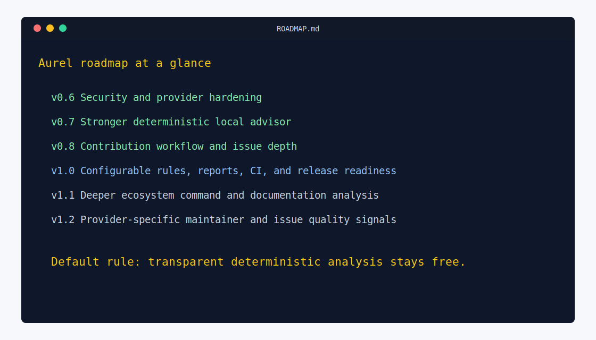

# Aurel Roadmap

This roadmap keeps Aurel comprehensive while protecting the project goal: a free, open-source contributor-readiness CLI that anyone can run and improve.

Use this roadmap to understand what has already landed, what belongs in the current release scope, and what should wait for a later version.

## v0.6: Security And Provider Hardening

- Scope GitHub tokens to GitHub requests only.
- Add regression tests for provider credential boundaries.
- Reduce duplicate provider calls during analysis.
- Harden provider response parsing for invalid JSON and malformed content.
- Document free-core and token-handling expectations.

## v0.7: Stronger Local Advisor

- Add more README/setup analysis by ecosystem.
- Detect missing install, test, lint, build, and local-run commands.
- Explain exactly why each score cap was applied.
- Generate a fuller contributor onboarding path: read first, run first, change first.
- Improve generated improvement backlog items with acceptance criteria.
- Keep every recommendation deterministic and test-covered.

## v0.8: Contribution Workflow Depth

- Detect issue templates and pull request templates.
- Check whether beginner issue labels exist on GitHub, GitLab, and Bitbucket where possible.
- Add issue-quality hints when beginner issues are too vague.
- Add maintainer-facing suggestions for labeling and scoping first issues.
- Add Markdown sections for program organizers and maintainers.

## v1.0: Configurable Rules, Reports, And Release Readiness

- Expand `aurel.yml` with custom score weights and required signals.
- Add profile-specific recommended checks.
- Add organization presets for classrooms, open-source programs, and maintainer audits.
- Validate config files with useful error messages.
- Add JSON output for automation.
- Add HTML report generation if it stays dependency-light.
- Add report comparison between two runs.
- Add CI usage examples for maintainers.
- Stabilize CLI flags and report schema.
- Add package publishing.
- Add linting, type checks, and security checks to CI.
- Add release automation after the test pipeline is reliable.
- Publish contribution guides for adding providers, profiles, checks, and advisor rules.
- Keep Windows and `python -m aurel` execution documented and covered by tests.

## v1.1: Deeper Ecosystem Analysis

- Infer install, run, test, lint, and build commands from project metadata.
- Compare discovered commands with README and contributor docs.
- Add profile-specific documentation hints for common frameworks.
- Improve stale or contradictory documentation detection.

## v1.2: Provider And Maintainer Signals

- Add richer provider-specific issue quality checks.
- Add maintainer responsiveness hints where public provider data is available.
- Add optional organization-level summaries for cohorts and audits.
- Keep provider tokens scoped to their provider.

## Optional Future Advisor Work

Aurel can eventually support optional local/offline advisor adapters, but the default system should remain deterministic and free. Optional adapters must never be required for scoring, reports, or Starter PR Kit output.
