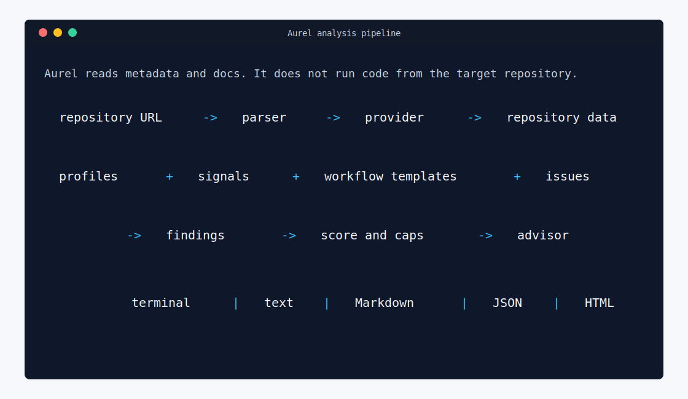

# Aurel Architecture

Aurel is built as a small pipeline. Each step produces structured data that the next step can use.

Use this page when you want to understand how a repository URL becomes a scored report, or when you need to decide which module should own a change.



```text
repository URL
  -> parser
  -> provider
  -> profile detection
  -> community signals
  -> content findings
  -> workflow template readiness
  -> issue readiness
  -> scoring
  -> advisor recommendations
  -> terminal, text, Markdown, JSON, or HTML report
```

## Core Principles

- Core analysis must stay free to run.
- Public repositories should work without secrets.
- Optional tokens are only for provider rate limits or access chosen by the user.
- Paid APIs, hosted AI services, and secret-dependent features must not be required.
- Scoring should be deterministic, explainable, and covered by tests.
- Suggestions should cite evidence instead of acting like guesses.
- JSON reports should include stable IDs for repeated records so CI and dashboards can track changes.

## Main Modules

- `aurel/cli.py`: owns argument parsing, terminal banner output, report format selection, score gates, and exit codes.
- `aurel/parser.py`: validates repository URLs and extracts provider, owner, and repo.
- `aurel/providers.py`: reads remote repository files, repository path listings, and issue metadata.
- `aurel/profiles.py`: detects broad repository type from files.
- `aurel/checks.py`: checks contributor-readiness signals such as docs, license, and security policy.
- `aurel/workflow.py`: checks issue and pull request templates in common provider locations.
- `aurel/analyzer.py`: orchestrates profile, signals, workflow readiness, findings, issue readiness, scoring, and recommendations.
- `aurel/scorer.py`: calculates category scores and score caps.
- `aurel/advisor.py`: ranks practical improvement recommendations.
- `aurel/guidance.py`: builds the Starter PR Kit, onboarding path, and improvement backlog.
- `aurel/config.py`: loads project-specific `aurel.yml` rules, presets, labels, and command checks.
- `aurel/report.py`: formats terminal, text, Markdown, JSON, HTML, and comparison output.

If you are changing behavior, start with the module that owns the decision and then update the matching tests. For example, profile detection belongs in `profiles.py`, but user-facing explanation for that profile belongs in `report.py` or `guidance.py`.

## Execution Flow

Users should run Aurel with the installed `aurel` command. The command calls `aurel.cli:main`.

`aurel start` prints the startup banner without running repository analysis. This is a human-facing smoke check for local setup and brand presentation; it does not create persistent state.

The CLI does not run code from analyzed repositories. It only parses the target URL, makes provider API requests, analyzes returned metadata/content, and writes reports locally when `--output` is used.

For GitHub repositories, Aurel first asks for the repository tree and caches the returned paths for the current analysis. That avoids dozens of one-file API requests when profile detection, contributor-signal checks, and workflow-template checks all need file existence answers. If the tree lookup is blocked or unsupported, Aurel falls back to targeted file checks.

Machine-readable output must stay clean: terminal runs can show the banner, but JSON output should not include human status lines on stdout. Plain text output is intended for saved `.txt` report documents and does not include the startup banner.

## Extension Points

Add a new repository provider:

- update `aurel/parser.py` if the URL shape is new
- add provider calls in `aurel/providers.py`
- test parsing and remote-call behavior with fakes

Add a new repository profile:

- add signals in `aurel/profiles.py`
- include clear evidence paths
- add tests in `tests/test_profiles.py`

Add a new readiness signal:

- add default paths in `aurel/checks.py`
- update config support when the signal should be configurable
- update scoring only when the signal changes user-facing readiness
- add tests for present, missing, and optional cases

Add workflow-template coverage:

- add common provider paths in `aurel/workflow.py`
- keep the result structured through `WorkflowReadiness`
- add tests in `tests/test_workflow.py`

Improve recommendations:

- add deterministic rules in `aurel/advisor.py`
- include action, reason, effort, confidence, evidence, and estimated score gain
- avoid vague suggestions that cannot be traced to findings or signals
- add tests in `tests/test_advisor.py`

Improve reports:

- update `aurel/report.py`
- keep output readable in plain terminals
- keep JSON report fields stable and include structured evidence
- update `examples/sample_report.md`
- add tests for important report sections

See [EXTENDING.md](EXTENDING.md) for contributor-facing extension guidance, [REPORT_SCHEMA.md](REPORT_SCHEMA.md) for JSON fields, and [CI_USAGE.md](CI_USAGE.md) for automation examples.

## Advisor Policy

The default advisor is deterministic. It should remain the source of truth because contributors can inspect it, test it, and improve it without cost.

Future optional advisor adapters may exist, but they must follow these rules:

- disabled by default
- no required paid service
- no required hosted AI API
- no secrets required for core output
- scoring remains deterministic
- output explains evidence and confidence
