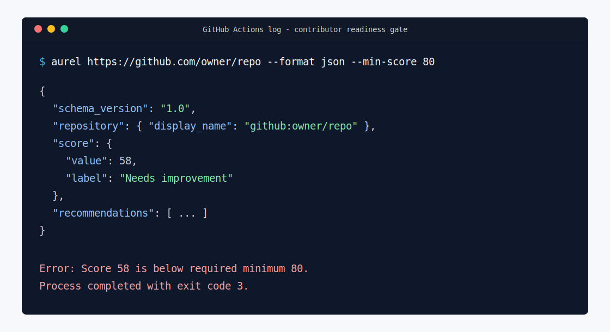

# CI Usage

Aurel can run in CI without secrets for public repositories. Use JSON output when another tool needs to parse the result, and use `--min-score` when the workflow should fail below a readiness threshold.

Use this page when you want a scheduled readiness check, a pull request score gate, or a JSON artifact that another workflow step can read.



## Repository Automation

This repository includes GitHub Actions workflows for contributor checks:

- `CI` runs on every branch push, pull request, and manual dispatch. It runs the pytest suite across Python 3.10, 3.11, and 3.12, then runs Ruff, mypy, and package build validation.
- `Security` runs on every branch push, pull request, a weekly schedule, and manual dispatch. It runs CodeQL, Bandit, `pip-audit`, and dependency review for pull requests.
- `Release` runs for `v*` tags and manual dispatch. It reruns release tests and security checks before building and publishing the package.

To make these checks block merges, enable branch protection for `main` in GitHub and require the `CI` and `Security` status checks before merging pull requests. The release workflow expects PyPI trusted publishing to be configured for this repository before tagged releases can publish.

## Basic Score Gate

This workflow installs Aurel, writes a JSON report, and fails with exit code `3` if the score is below the threshold.

```yaml
name: Contributor readiness

on:
  workflow_dispatch:
  schedule:
    - cron: "0 9 * * 1"

jobs:
  aurel:
    runs-on: ubuntu-latest
    steps:
      - uses: actions/checkout@v6
      - uses: actions/setup-python@v6
        with:
          python-version: "3.12"
      - run: python -m pip install .
      - run: |
          aurel https://github.com/owner/repo \
            --format json \
            --output reports/aurel.json \
            --min-score 80
```

## Compare Two Runs

Store a previous JSON report as a workflow artifact, then compare it with the current run:

```bash
aurel https://github.com/owner/repo \
  --format json \
  --output reports/current.json \
  --compare reports/previous.json
```

The comparison reports score movement plus new and resolved findings and recommendations.

## Local CI Smoke Test

Before adding Aurel to CI, verify the command works locally from the repository root:

```bash
aurel --help
aurel start
aurel https://github.com/owner/repo --format json --min-score 80
```

Use `aurel` after `python -m pip install .` or `python -m pip install -e .`. The `start` command is a local smoke check for humans; CI can skip it unless you want the banner in logs.

## Token Use

For GitHub public repositories, `GITHUB_TOKEN` can raise API limits. Aurel only sends GitHub tokens to GitHub requests. Core analysis remains deterministic and does not require hosted AI services, paid APIs, or repository write access.

If a CI run reports `Could not reach remote provider`, the CLI started but the runner could not reach the provider API over HTTPS. Check proxy/firewall rules and provider availability before changing scoring or parser code.
