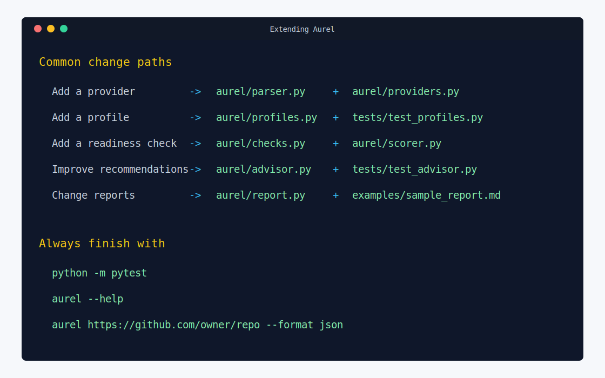

# Extending Aurel

This guide explains where to add common v1.0 extension work. Keep changes deterministic, evidence-backed, and covered by tests.

Use this page when you know what kind of behavior you want to add but need to find the right source file and test file.



## Add A Provider

- Parse the URL shape in `aurel/parser.py`.
- Keep remote calls in `aurel/providers.py`.
- Return existing model types from `aurel/models.py`.
- Add provider tests with fake responses. Do not depend on live API calls.
- Keep network failures surfaced as `ProviderError` messages that explain whether the CLI could not reach the provider, was rate-limited, or received an unexpected response.

## Add A Profile

- Add file signals in `aurel/profiles.py`.
- Include precise evidence paths.
- Add tests in `tests/test_profiles.py`.
- Add profile command hints in `aurel/analyzer.py` when README command detection should change.

## Add A Readiness Check

- Add signal paths or config knobs in `aurel/config.py`.
- Keep file-existence checks in `aurel/checks.py`.
- Add score impact in `aurel/scorer.py` only when the check changes user-facing readiness.
- Add report output in `aurel/report.py` when maintainers need to see the result.

## Add Advisor Rules

- Add deterministic recommendation logic in `aurel/advisor.py`.
- Include action, reason, priority, effort, confidence, estimated score gain, evidence, and source.
- Prefer evidence from findings, signals, score caps, issue readiness, or workflow readiness.
- Add tests in `tests/test_advisor.py`.

## Add Report Fields

- Add structured fields to `analysis_to_dict` in `aurel/report.py`.
- Keep `schema_version` stable unless consumers need to adapt.
- Include stable IDs for new repeated finding-like or recommendation-like records.
- Update text, Markdown, or HTML output when the field is useful to humans.

## Verify Execution

After changes, run:

```bash
python -m pytest
aurel --help
aurel https://github.com/owner/repo --format json
```

If the last command fails with `Could not reach remote provider`, verify network access, proxy configuration, or provider rate limits. That error means the package entry point worked and the failure happened during the remote API request.
