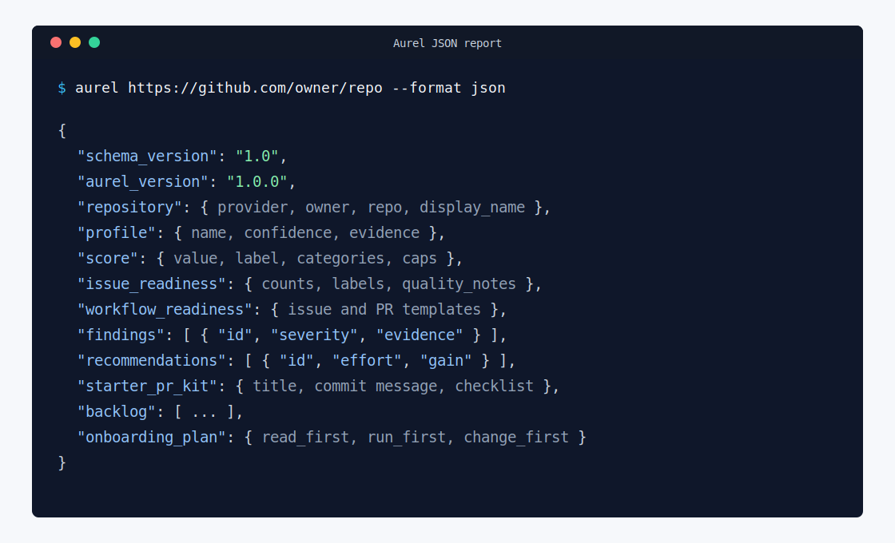

# JSON Report Schema

Aurel v1.0 JSON reports use `schema_version: "1.0"`. Additive fields may be introduced in later minor versions, but existing field names and meanings should remain stable for v1.x automation.

Use this page when you are writing CI checks, dashboards, comparison scripts, or any tool that reads `--format json` output.



## Top-Level Fields

- `schema_version`: report schema version.
- `aurel_version`: CLI version that generated the report.
- `repository`: provider, owner, repo name, full name, and display name.
- `profile`: detected profile, confidence, and structured evidence.
- `score`: score value, label, categories, score caps, and applied cap.
- `issue_readiness`: issue label checks, issue counts, confidence, and quality notes.
- `workflow_readiness`: issue and pull request template status.
- `signals`: configured contributor-readiness signals.
- `findings`: evidence-backed findings with stable `id` values.
- `recommendations`: ranked fixes with stable `id` values.
- `starter_pr_kit`: suggested first contribution, title, commit message, and checklist.
- `backlog`: maintainer-facing improvement backlog.
- `onboarding_plan`: read-first, run-first, and change-first guidance.

## Stable IDs

Repeated records such as findings, recommendations, and backlog items include stable IDs derived from their source fields and evidence. These IDs are intended for comparing reports across runs, CI dashboards, and downstream tools.

## Evidence

Evidence is represented as objects:

```json
{
  "kind": "path",
  "value": "README.md"
}
```

Current `kind` values are `path` and `text`.

## CLI Output Contract

Use `--format json` when another program needs to parse Aurel output:

```bash
aurel https://github.com/owner/repo --format json
```

The JSON document is written to stdout. Human status messages, such as report file paths, belong on stderr so automation can parse stdout directly.

Use `--format text --output reports/aurel.txt` when a human-readable plain text document is needed. The `.txt` extension also selects text output automatically when `--format` is omitted.
