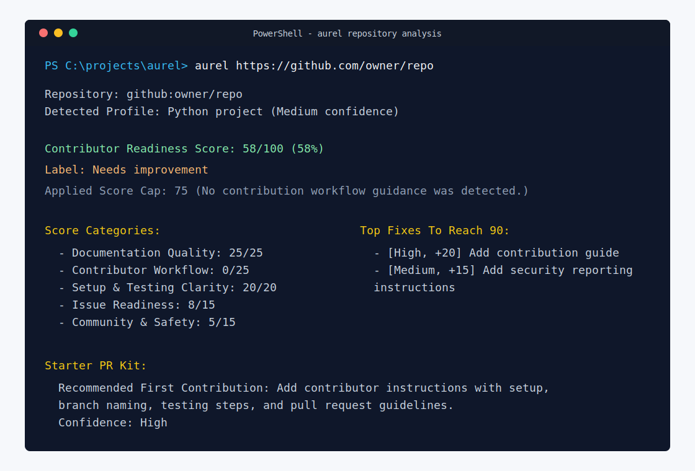

# Sample Aurel Report

This example shows the kind of plain terminal report a maintainer or beginner contributor can read after running Aurel. The screenshot gives a quick overview; the text block below is easier to copy into issues, pull requests, or docs.



```text
Repository: github:owner/repo
Detected Profile: Python project (Medium confidence)

Contributor Readiness Score: 58/100 (58%)
Label: Needs improvement
Applied Score Cap: 75 (No contribution workflow guidance was detected.)

Score Categories:
- Documentation Quality: 25/25
- Contributor Workflow: 0/25
- Setup & Testing Clarity: 20/20
- Issue Readiness: 8/15
- Community & Safety: 5/15

Issue Readiness:
- Checked: no; beginner-friendly issues found: 0; thin sampled issues: 0; confidence: Low
- Issue readiness was not checked.

Workflow Templates:
- Issue templates: not detected
- Pull request template: not detected
- Issue and pull request templates were not detected in common locations.

Top Fixes To Reach 90:
- [High, +20] Add contribution guide: Add contributor instructions covering setup, tests, branch naming, review expectations, and first PR guidance.
- [Medium, +15] Add security reporting instructions: Add responsible disclosure instructions or a security contact path.

Newcomer Onboarding Path:
Read First:
- Read README.md for project purpose and setup context.
- Check issues, docs, or maintainer notes for contribution workflow.
- Use the detected profile as context: Python project.
Run First:
- Run the documented install or setup command.
- Run the smallest documented example or local start command.
- Run the documented test command after making a change.
- For Python projects, prefer commands that work from a clean virtual environment.
Change First:
- Add or improve contributor instructions with setup, branch naming, testing steps, and pull request guidelines.
- Start with this report finding: Contribution guide not detected.
- Keep the first pull request small, documented, and easy to review.

Profile Evidence:
+ pyproject.toml
+ requirements.txt

Contributor Signals:
+ Project overview or docs entry point: found at README.md (required)
+ License information: found at LICENSE (required)
? Contribution guide: not detected (required)
? Security reporting instructions: not detected (required)
? Community behavior expectations: not detected (required)

Findings:
- [Medium, Medium confidence] Contribution guide not detected; cap 75: Add contribution instructions covering setup, tests, branch naming, and pull request expectations.
- [Low, Medium confidence] Security reporting instructions not detected; cap 89: Add responsible disclosure instructions or explain where security reports should go.
- [Low, Medium confidence] Community behavior expectations not detected; cap 89: Add community behavior expectations if the project accepts external participation.

Starter PR Kit:
Recommended First Contribution: Add or improve contributor instructions with setup, branch naming, testing steps, and pull request guidelines.
Why This Helps: A clear contributing guide helps new developers understand how to make their first change without guessing the workflow.
Confidence: High

Improvement Backlog:
- [High] Add contributor instructions: docs: add contributing guide
  - Acceptance: The guide includes setup, test, branch, and pull request steps.
  - Acceptance: The guide names the smallest safe first contribution path.

Maintainer Guidance:
- Add issue templates so bug reports and feature requests arrive with triage context.
- Add a pull request template with summary, testing, and reviewer checklist fields.

Program Organizer Notes:
- Use this repository cautiously for cohorts until the high-priority readiness gaps are addressed.
- Ask maintainers to add issue templates before routing many first-time contributors here.
```
